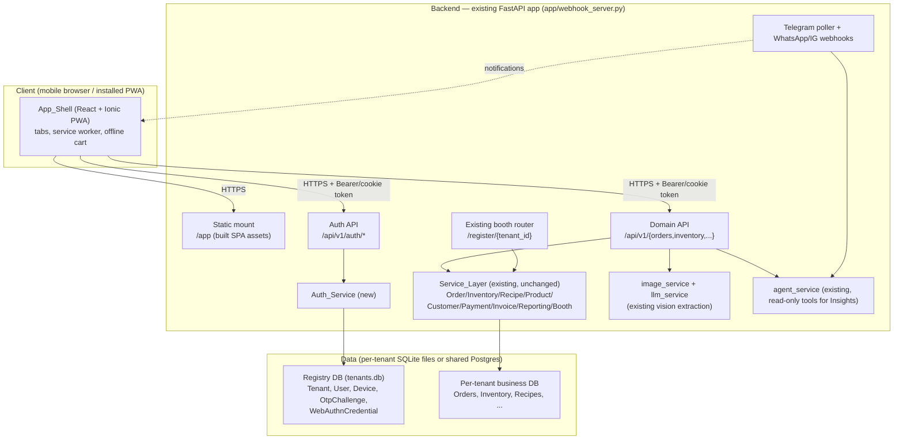
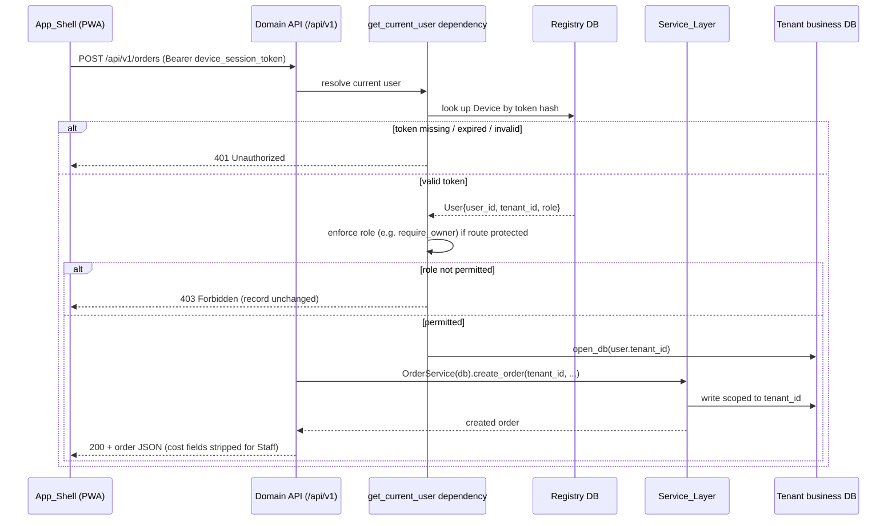

# Design Document: App-First Pivot

## Overview

KitchenOS is pivoting from a chat-first product to an **app-first** product, guided by the principle **"UI for deterministic actions, AI for reasoning."** Today all operations flow through the Telegram/WhatsApp LLM agent (`app/handlers/request_handler.py` → `app/services/agent_service.py` → `app/services/tool_executor.py` → service layer). A zero-LLM Register/Booth web app already exists at `/register/{tenant_id}` (`app/booth/`) and proves the pattern: a thin HTTP layer over the UI-agnostic service layer.

This feature expands that proven pattern into a full **Progressive Web App (PWA)** with tabbed navigation (Sell, Orders, Inventory, Recipes, Customers, Invoices, Expenses, Ask/Insights), adds **authentication and multi-user roles**, and closes the current security gap where the only access control is the unguessable tenant UUID in the URL.

The design deliberately **reuses the existing service layer unchanged** for all domain logic. The new work is concentrated in four areas:

1. A new **versioned REST API** (`/api/v1/...`) — thin HTTP wrappers over existing services, mounted on the existing FastAPI `app` in `app/webhook_server.py`.
2. A new **Auth_Service** — phone+OTP device sessions, per-user PINs, WebAuthn, roles (Owner/Staff), Sell/Manage mode.
3. A new **PWA frontend** — a build-step SPA served as static assets by FastAPI, alongside the existing booth static mount.
4. **Demotion of Telegram/WhatsApp** to notification senders plus an optional async command path (the agent path stays intact throughout).

Key non-goals (per requirements): native app-store wrapping, barcode scanning, and a desktop app are out of scope.

### Design principles

- **No business-logic rewrite.** `OrderService`, `InventoryService`, `RecipeService`, `ProductService`, `CustomerService`, `PaymentService`, `InvoiceService`, `ReportingService`, and `BoothService` are called as-is. The API layer adapts HTTP ↔ service dataclasses only (Requirement 20.4, 20.5).
- **Server-side authorization is authoritative.** Hidden tabs are a UX convenience; every request is independently authorized on the Backend (Requirement 5.6).
- **Respect the per-tenant-file database model.** Auth entities that must be resolved *before* a tenant DB is opened live in the shared registry DB; per-tenant business data stays in per-tenant files.
- **Telegram keeps working the entire time.** The pivot is additive; the polling bot and webhook routes are never removed.

### Recommended frontend stack

**React + TypeScript + Vite, with Ionic React as the mobile UI kit**, and Workbox for the service worker.

- **React + Vite**: mature component framework with a fast build; the built static bundle (HTML/CSS/JS) is served by FastAPI exactly like the existing booth static mount, so no new infrastructure or process is required (Requirement 20.1, satisfies the "build-step SPA served as static assets" constraint).
- **Ionic React**: provides mobile-first, touch-optimized components (tabs, sheets, lists, inputs) that match the counter/tablet use case and give installable-PWA affordances out of the box. Alternative considered: a headless kit (e.g. Tailwind + Radix); Ionic is preferred because it ships the mobile interaction patterns (bottom tab bar, pull-to-refresh, action sheets) the Sell surface needs without hand-rolling them.
- **Workbox**: generates a service worker with precaching of the app shell and **NetworkFirst** runtime caching of all `GET /api/v1/*` reads, satisfying the offline requirements (Requirement 1, 18) with a well-tested library rather than a hand-written service worker. NetworkFirst (rather than StaleWhileRevalidate) ensures an online device always sees current data immediately after a write — e.g. a newly added Sell item or a freshly created order — while still falling back to the last-seen response when offline.

This is a recommendation; the acceptance criteria only require "a component-based front-end framework and a mobile UI kit" (Requirement 20.1), so the concrete choice is a design decision, not a requirement.

---

## Architecture

### System context



### Request flow (authenticated domain request)



### Where things live in the codebase

```
app/
├── webhook_server.py          ← register_api() added here (mounts /api/v1 + /app static)
├── api/                        ← NEW package: the REST API layer
│   ├── __init__.py
│   ├── deps.py                 ← get_current_user, require_owner, get_tenant_db_for_user
│   ├── schemas.py              ← Pydantic request/response models (role-aware serializers)
│   ├── errors.py               ← shared HTTP error mapping (ValueError → 400/404/409)
│   ├── auth_router.py          ← /api/v1/auth/*  (OTP, device, PIN, WebAuthn, users, mode)
│   ├── sell_router.py          ← /api/v1/sell/*  (reuses BoothService)
│   ├── orders_router.py        ← /api/v1/orders/*
│   ├── inventory_router.py     ← /api/v1/inventory/*
│   ├── recipes_router.py       ← /api/v1/recipes/*
│   ├── customers_router.py     ← /api/v1/customers/*
│   ├── invoices_router.py      ← /api/v1/invoices/*
│   ├── expenses_router.py      ← /api/v1/expenses/*
│   ├── insights_router.py      ← /api/v1/insights/*  (read-only agent path)
│   └── ingestion_router.py     ← /api/v1/ingestion/*  (image → Ingestion_Draft)
├── auth/                       ← NEW package: Auth_Service
│   ├── __init__.py
│   ├── auth_service.py         ← OTP, device sessions, PIN, lockout, user switching
│   ├── otp_sender.py           ← OtpSender interface + NotificationChannelSender + SmsSender
│   ├── webauthn_service.py     ← WebAuthn registration/verification
│   ├── security.py             ← hashing (argon2), token generation, constant-time compare
│   └── models_auth.py          ← User, Device, OtpChallenge, WebAuthnCredential (registry DB)
├── notifications/              ← NEW package: outbound notification triggers
│   ├── __init__.py
│   └── notifier.py             ← order alert, expiry warning, daily summary senders
├── services/                   ← EXISTING, unchanged (domain logic)
└── booth/                      ← EXISTING, unchanged (reused by sell_router)

frontend/                       ← NEW: React + Ionic PWA source (built to app/webapp_static/)
```

The built SPA is emitted to `app/webapp_static/` and mounted read-only, mirroring the existing `app.mount("/register/static", StaticFiles(...))` pattern in `register_booth()`.

---

## Components and Interfaces

### 1. API layer registration

A new `register_api()` in `app/webhook_server.py`, called once at startup from `telegram_listener.py` alongside `register_booth()`:

```python
def register_api():
    from fastapi.staticfiles import StaticFiles
    from pathlib import Path
    from app.api import (
        auth_router, sell_router, orders_router, inventory_router,
        recipes_router, customers_router, invoices_router,
        expenses_router, insights_router, ingestion_router,
    )
    for r in (auth_router, sell_router, orders_router, inventory_router,
              recipes_router, customers_router, invoices_router,
              expenses_router, insights_router, ingestion_router):
        app.include_router(r.router)  # each router uses prefix="/api/v1/..."

    # Serve the built PWA as static assets (SPA fallback to index.html)
    static_dir = Path(__file__).parent / "webapp_static"
    app.mount("/app", StaticFiles(directory=str(static_dir), html=True), name="webapp")
```

The existing CORS middleware is extended to allow the production origin. HTTPS termination and HTTP→HTTPS redirect (Requirement 1.7, 1.8) are handled at the nginx layer (existing `nginx + Let's Encrypt on kitchenos.info` per DESIGN.md); a FastAPI `HTTPSRedirectMiddleware` is added as a defense-in-depth fallback.

### 2. Auth dependencies (`app/api/deps.py`)

These **replace the naive `_get_tenant_db` UUID-only access** used by the booth router. The tenant is derived from the authenticated user, never from a URL path parameter.

```python
async def get_current_user(request: Request) -> AuthedUser:
    """
    Resolve the device session token (Authorization: Bearer <token>, or an
    httpOnly cookie), hash it, look up the Device in the registry DB, verify
    it is unexpired, and return the associated user.

    Raises 401 if the token is missing, unknown, or expired (Req 2.11, 5.8, 19.4).
    Returns AuthedUser{user_id, tenant_id, role, device_id}.
    """

def require_owner(user: AuthedUser = Depends(get_current_user)) -> AuthedUser:
    """Raise 403 unless user.role == 'owner' (Req 5.4, 5.7, 11.7, 16.6)."""

def get_tenant_db_for_user(user: AuthedUser = Depends(get_current_user)):
    """
    Yield a business-DB session for the authenticated user's tenant.
    Tenant scoping is derived from the token, so cross-tenant access is
    structurally impossible (Req 19.2, 19.6).
    """
```

`AuthedUser` is a small dataclass resolved once per request. Domain routers depend on `get_tenant_db_for_user` (which itself depends on `get_current_user`), guaranteeing every domain query is tenant-scoped.

### 3. Auth_Service (`app/auth/auth_service.py`)

```python
class AuthService:
    def __init__(self, registry_db: Session, otp_sender: OtpSender): ...

    # ── Phone + OTP → device session (Req 2, 3) ──
    def request_otp(self, phone: str) -> OtpRequestResult
        # Validate phone format (Req 2.3). Resolve phone → tenant/user.
        # Generate 4–8 digit OTP, hash+store with 5-min expiry (Req 2.2, 2.9).
        # Delegate delivery to OtpSender (tiered: channel → SMS) (Req 3).
    def verify_otp(self, phone: str, code: str, device_info: dict) -> DeviceSession
        # Compare against stored hash; enforce max 5 attempts (Req 2.8),
        # expiry (Req 2.9), single-use (invalidate on success).
        # On success, mint a Device_Session_Token valid OTP_SESSION_DAYS
        # (config, clamped 30–90) (Req 2.5, 2.6). Return token (returned once).

    # ── PIN (Req 4) ──
    def set_pin(self, user_id: UUID, pin: str) -> None      # validate 4–8 digits (Req 4.1, 4.2), argon2 hash
    def verify_pin(self, user_id: UUID, pin: str) -> bool   # lockout after 5 fails for 300s (Req 4.3–4.5)

    # ── User management (Owner-only, Req 5.5, 5.7) ──
    def create_user(self, owner: AuthedUser, name, phone, role) -> User
    def list_users(self, owner: AuthedUser) -> list[User]

    # ── Mode transitions (Req 6) ──
    def elevate_to_manage(self, device_id, pin_or_webauthn) -> bool
        # Requires Owner-role PIN/WebAuthn; lockout after 5 fails for 30s (Req 6.3, 6.7)
```

**OTP delivery interface** (`app/auth/otp_sender.py`) — pluggable providers:

```python
class OtpSender(Protocol):
    async def send(self, phone: str, code: str) -> DeliveryResult: ...

class TieredOtpSender:
    """
    Req 3: if phone is associated with a Notification_Channel, send via that
    channel first (5s budget); if no channel or no delivery confirmation
    within 30s, fall back to SMS; if SMS also unconfirmed within 30s, return
    a delivery-failure indication and do NOT mark the OTP delivered (Req 3.4).
    """
    def __init__(self, channel_sender: NotificationChannelSender, sms_sender: SmsSender): ...

class NotificationChannelSender:  # reuses existing telegram/whatsapp send paths
class SmsSender:                  # NEW integration (e.g. an SMS/DLT provider)
```

**SMS provider is a new external integration.** For India, transactional SMS requires **DLT (Distributed Ledger Technology) registration** of the sender ID and message templates with a telecom operator; the OTP template must be pre-registered and approved. This is an operational dependency, not a code dependency, and is flagged in the rollout plan. The `SmsSender` is coded against a provider abstraction so the concrete provider (e.g. an Indian SMS gateway) can be swapped via config.

### 4. WebAuthn (`app/auth/webauthn_service.py`)

Wraps the `webauthn` Python library (new dependency). Stores a `WebAuthnCredential` per user (credential id, public key, sign count). Provides registration (attestation) and authentication (assertion) ceremonies used by `/api/v1/auth/webauthn/*` (Req 4.6–4.8). WebAuthn is optional; PIN remains the baseline unlock.

### 5. Domain routers — mapping to existing services

Every domain router is a thin wrapper. The table shows the endpoint → existing service method mapping and the role gate.

| Domain | Endpoint | Service call (existing) | Role gate / field policy |
|---|---|---|---|
| **Auth** | `POST /api/v1/auth/otp/request` | `AuthService.request_otp` | public |
| | `POST /api/v1/auth/otp/verify` | `AuthService.verify_otp` | public |
| | `GET /api/v1/auth/session` | resolve current user from device token (Req 2.10) | authed |
| | `POST /api/v1/auth/pin` | `AuthService.set_pin` | authed |
| | `POST /api/v1/auth/pin/verify` | `AuthService.verify_pin` | authed |
| | `POST /api/v1/auth/webauthn/register` | `WebAuthnService.*` | authed |
| | `POST /api/v1/auth/webauthn/verify` | `WebAuthnService.*` | authed |
| | `GET/POST /api/v1/auth/users` | `AuthService.list_users/create_user` | **Owner** (Req 5.7) |
| | `POST /api/v1/auth/mode/manage` | `AuthService.elevate_to_manage` | Owner PIN/WebAuthn (Req 6.3) |
| **Sell** | `GET /api/v1/sell/session` | `BoothService` + always-on session sync (Req 8.1, 8.9) | Owner+Staff |
| | `POST /api/v1/sell/products` | `ProductService.create_product` + session sync (Req 8.10) | **Owner** |
| | `POST /api/v1/sell/checkout` | `BoothService.checkout` | Owner+Staff; sets attribution (Req 7) |
| | `GET /api/v1/sell/receipt/{order_id}` | booth receipt path | Owner+Staff |
| | `GET /api/v1/sell/invoice/{order_id}` | `InvoiceService.build_invoice_data/generate` | Owner+Staff |
| **Orders** | `POST /api/v1/orders` | `OrderService.create_order` | Owner+Staff |
| | `GET /api/v1/orders` (filter date/status) | `OrderService.get_upcoming_orders` + query | Owner+Staff |
| | `POST /api/v1/orders/{id}/deliver` | `OrderService.mark_delivered` | Owner+Staff |
| | `POST /api/v1/orders/{id}/cancel` | order status update | Owner+Staff |
| | `DELETE /api/v1/orders/{id}` | order delete | **Owner** (Req 9.6) |
| **Inventory** | `POST /api/v1/inventory` | `InventoryService.create_item` | Owner+Staff |
| | `GET /api/v1/inventory` | `InventoryService.list_items` | Staff: **cost hidden** (Req 10.7) |
| | `PATCH /api/v1/inventory/{id}` | `InventoryService.update_item` | Owner+Staff |
| **Recipes** | `POST /api/v1/recipes` | `RecipeService.create_recipe` | Owner+Staff |
| | `POST /api/v1/recipes/{id}/components` | `RecipeService.add_component` | Owner+Staff |
| | `GET /api/v1/recipes/{id}/cost` | `RecipeService.calculate_cost` | **Owner** (Req 11.7) |
| | `GET /api/v1/recipes` | `RecipeService.list_recipes` | Staff: cost-per-unit omitted |
| **Customers** | `POST /api/v1/customers` | `CustomerService.create_customer` | Owner+Staff |
| | `GET /api/v1/customers?q=` | `CustomerService.search` | Owner+Staff (Req 12.2) |
| **Invoices** | `POST /api/v1/invoices` | `InvoiceService.build_invoice_data/generate` | Owner+Staff |
| **Expenses** | `POST /api/v1/expenses` | expense create (service layer) | **Owner** (surface hidden for Staff, Req 14.6) |
| | `GET /api/v1/expenses` (filter) | expense list | **Owner** |
| **Insights** | `POST /api/v1/insights/ask` | read-only agent / `ReportingService` | Staff: financial queries **blocked** (Req 16.6) |
| **Ingestion** | `POST /api/v1/ingestion/extract` | `ImageService.process_*` | Owner+Staff |
| | `POST /api/v1/ingestion/confirm` | routes to the matching domain create | role of target domain |

**Role-aware serialization.** Response models in `app/api/schemas.py` are produced by serializer functions that take the `AuthedUser`. For Staff, cost/financial fields (`cost_per_unit`, recipe `cost_per_unit`, profit values) are **omitted from the serialized payload**, and the corresponding read endpoints (recipe cost, expenses, financial insights) are rejected with 403 before the service is even called (Req 5.4, 10.7, 11.7, 14.6, 16.6). Hiding at serialization is defense-in-depth; the primary control is the route-level role gate.

### 6. Sell surface & attribution (`sell_router` + `BoothService`)

The Sell surface reuses `BoothService.checkout(...)` unchanged for totals and record creation (Req 8.6). Attribution (Req 7) is layered on top:

- A new nullable `created_by_user_id` column is added to `Order` (see Data Models). The `sell_router` sets it from `AuthedUser.user_id` immediately after `BoothService.checkout` returns, within the same DB transaction/session, before commit is finalized — so the attribution is persisted atomically with the sale.
- If no authenticated user is available, the request never reaches checkout (the `get_current_user` dependency rejects with 401), satisfying "reject the sale, persist no sale record" (Req 7.5).
- **Idempotency** (Req 8.3, 18.5): the checkout request carries a client-generated `Idempotency-Key`. A small `SellIdempotency` record (registry-independent, stored in the tenant DB) maps `(tenant_id, idempotency_key) → order_id`. On a duplicate key, the API returns the already-created order instead of creating a second one. This makes offline replay at-most-once.

**Always-on session + catalog sync (Req 8.1, 8.9).** The app-first Sell surface does not ask the user to open a booth "event" session. Instead `GET /api/v1/sell/session` calls a `_ensure_session_synced` helper that (1) starts a single always-on session named `"Sell"` (`mode="regular"`) when none is active, and (2) adds every catalog product variant not already present as a session item, using the variant's own price and `stock_qty=None` (**unlimited stock**). The sync is idempotent (variants already in the session are skipped, and the "already added" `ValueError` is caught defensively), so repeated calls never duplicate items and the grid always mirrors the current catalog.

**Owner catalog setup on the Sell surface (Req 8.10, 8.11, 8.12).** Two Owner-only affordances let the Owner populate what can be sold without leaving the counter screen:
- **Add item** → `POST /api/v1/sell/products` (`require_owner`) creates a single-variant product via `ProductService.create_product` (`size_label` defaults to `"standard"`), then re-runs the session sync so the new variant is immediately tappable. A duplicate name maps to 409.
- **Upload catalog** → reuses the shared image-ingestion path (`ingestion_router`, `doc_type="catalog"`): the extracted products are proposed for confirm/edit, and on confirmation created and synced into the session.
Staff receive 403 on `POST /products` and the frontend hides both actions for the Staff role.

**Tax at checkout (Req 8.6).** The Sell surface exposes an optional GST/tax-rate (%) input at checkout, mirroring order/invoice generation. When set, the rate is sent as `gst_rate` on the checkout body and the service layer applies it to the payable total; the surface shows a client-side taxed preview only, never altering the authoritative service computation.

### 7. Image ingestion (`ingestion_router`)

Confirm-and-edit, **no chat**:

```
POST /api/v1/ingestion/extract   (multipart image + doc_type)
   → validate size ≤ 10 MB and supported format (Req 15.8)
   → ImageService.process_{receipt,recipe,order,catalog,payment}_image(bytes)
   → shape result into a typed Ingestion_Draft (below)
   → 200 { draft } | 422 extraction failure (Req 15.9)

POST /api/v1/ingestion/confirm   ({ doc_type, draft })
   → route to the matching domain create:
        inventory → InventoryService.create_item   (purchase receipt → INVENTORY)
        receipt   → expense create                 (generic receipt → expense)
        recipe    → RecipeService.create_recipe + add_component
        order     → OrderService.create_order
        catalog   → ProductService.create_product
        payment   → PaymentService record payment
   → on domain failure: persist nothing, return error (Req 15.10)
```

**Doc-type fixed by launch context (no classification).** Ingestion can be launched **in-context from a domain surface** with a pre-determined `doc_type`, so the Backend does not run any model-driven intent/document classification — the launch context alone determines the pipeline (Req 15.11). Image bytes may come from a **camera capture or a file upload** (Req 15.12). The in-tab entry points are:

- **Inventory "Scan receipt"** — launches ingestion with `doc_type=inventory`; the confirmed draft's line items are created as INVENTORY items via `InventoryService.create_item`, and nothing is persisted if that create fails (Req 10.8, 10.9, 15.10, 15.13).
- **Recipes "Scan recipe"** — launches the existing recipe ingestion with `doc_type=recipe`, now startable in-context; the confirmed draft creates a recipe plus its components (Req 11.8, 11.9).

The generic `receipt → expense` path is retained alongside the new `inventory` path; `doc_type` disambiguates them (Req 15.13).

The frontend renders the draft as an **editable form** (Req 15.2, 15.3, 15.7). "Discard" is purely client-side — no persistence happens until `confirm` (Req 15.5).

### 8. Insights (`insights_router`)

Insights is now a **conversational agent chat**, not deterministic period aggregation. Two endpoints coexist:

- **`POST /api/v1/insights/chat` (primary).** Runs the existing `AgentService` **Plan→Execute→Summarise** loop with the **full `ToolExecutor`** (orders, inventory, customers, recipes, payments, reporting) and DB access, all **tenant-scoped** via `get_tenant_db_for_user`. The frontend Insights tab is a **chat UI**; date fields are **not required** — the model infers reporting ranges from the natural-language question (Req 16.1, 16.2). Order-cost answers use the same ingredient×unit-price summation as `ReportingService`, and missing unit prices are surfaced explicitly (Req 16.4).
- **`POST /api/v1/insights/ask` (retained).** The prior **deterministic** read-only path (curated read/reporting-tool allowlist / direct `ReportingService`) is kept for structured period queries and retains its Staff financial block.

Guarantees:

- Every tool invocation and data access while answering is scoped to the authenticated tenant (Req 16.1, 16.7) via `get_tenant_db_for_user`.
- If the agent cannot answer from the tenant's data, it returns an explicit "could not answer" message with no placeholder values (Req 16.5).
- **`AgentUnavailableError` → HTTP 502.** If the underlying LLM is unavailable or fails, the chat endpoint raises `AgentUnavailableError`, mapped to a `502` service-unavailable response; no fabricated answer is returned (Req 16.6).

**Known gap (future consideration).** The Staff financial-data restriction that the deterministic `/ask` path enforces is **not currently enforced on `/chat`** — because the agent has the full tool set, a Staff user could reach financial answers through the chat. Restricting financial tools for Staff on the chat path is flagged as future work (see Requirement 16 note); it is not yet enforced.

### 9. Notifications demotion (`app/notifications/notifier.py`)

The Telegram/WhatsApp listeners keep receiving messages (the agent path is untouched — Req 17.5, 17.8), but the App becomes the primary creation surface (Req 17.6). New **outbound** triggers are added:

- **Order alert** on new order detection (Req 17.1, 17.3) — includes order id, customer, items, total.
- **Subscription expiry warning** — once per calendar day during the 7-day pre-expiry window (Req 17.2), driven by a daily scheduled sweep over the registry.
- **Daily summary** — once per calendar day per tenant (Req 17.4): sales count, sales amount, pending-order count for the preceding 24h.
- **Delivery retry** — up to 3 attempts, record failure after exhaustion (Req 17.7).

Notifications are sent over the tenant's configured `messaging_platform` (existing `Tenant.messaging_platform`).

### 10. Frontend structure (`frontend/`)

```
frontend/
├── index.html
├── manifest.webmanifest        ← name, icons 192 & 512, start_url=/app, display=standalone (Req 1.1)
├── vite.config.ts              ← build → app/webapp_static/ ; Workbox SW plugin
├── public/icons/               ← 192x192, 512x512 PNGs
├── src/
│   ├── main.tsx
│   ├── sw.ts                   ← Workbox precache (app shell) + NetworkFirst runtime cache (all /api/v1 GETs) (Req 1.2, 18.1, 18.2)
│   ├── api/
│   │   ├── client.ts           ← fetch wrapper: attaches token, 30s timeout+abort (Req 20.3), retry policy
│   │   └── endpoints.ts        ← typed calls per domain
│   ├── auth/
│   │   ├── AuthContext.tsx     ← device token, current user, role, mode (Sell/Manage)
│   │   ├── OtpFlow.tsx, PinPad.tsx, WebAuthnButton.tsx, UserSwitcher.tsx
│   ├── offline/
│   │   ├── cartQueue.ts        ← IndexedDB queue of offline sales + idempotency keys (Req 18.3–18.6)
│   │   └── sync.ts             ← on reconnect, drain queue at-most-once, ≤3 retries
│   ├── components/             ← shared Ionic-based reusable components (Req 20.1)
│   └── tabs/
│       ├── Sell.tsx  Orders.tsx  Inventory.tsx  Recipes.tsx
│       ├── Customers.tsx  Invoices.tsx  Expenses.tsx  Insights.tsx
│       └── TabBar.tsx          ← role-based tab hiding (Req 1.10, 6.1, 14.6)
```

- **Routing/tabs**: Ionic tab bar with exactly the 8 required tabs (Req 1.9). Tab visibility is filtered by role/mode from `AuthContext` (Req 1.10, 6.1) — Staff/Sell_Mode hides Expenses, financial-only surfaces, and delete affordances.
- **State management**: React Query for server state (caching, retries, request de-dup) + Context for auth/mode. React Query's cache backs offline reads of the product catalog.
- **API client**: single `client.ts` attaches the device token (httpOnly cookie preferred, `Authorization: Bearer` fallback), enforces a 30-second abort timeout, and preserves unsaved input on failure (Req 20.3).
- **Session restore (Req 2.10)**: on startup `AuthContext` rehydrates the persisted Bearer token and calls `GET /api/v1/auth/session` to resolve the current user, so a reload on a trusted device reopens straight into the App without re-verifying an OTP. The Gate shows a loader during this check so a valid device never flashes the sign-in screen; a 401 clears the stored token and falls through to OTP. (Note: the httpOnly session cookie is `Secure`, so on plain-HTTP local dev the Bearer token in `localStorage` is the working path.)
- **First-run tab tour (Req 21.10)**: `components/TabTour.tsx` shows a one-time informational popup the first time a signed-in user opens each tab. The "seen" flag is stored in `localStorage` keyed by `user_id` + tab key, so it appears at most once per user account (per device) and is dismissible without blocking the tab.

**OTP delivery over the owner's channel (Req 3.1, 21.8).** The app-first `/auth/otp/request` uses the same tiered `TieredOtpSender` as the rest of the system. Two wiring details make Telegram delivery work end to end: (1) `RegistryChannelResolver` matches a stored phone whether or not it carries a leading `+` (it previously stripped `+` and missed `+91…` numbers, always falling back to SMS); (2) the running `TelegramBotListener` registers a Bot-API send function into `auth_router` (`set_telegram_otp_send`) when it starts the webhook server, so a known owner's code is delivered over their existing Telegram channel. A direct Bot API call is used (not the PTB `Application` client) because the webhook server runs in its own thread/event loop. SMS remains the fallback when no channel send path is wired (web-only dev, tests) or the channel does not confirm.
- **Offline**: `cartQueue.ts` persists completed offline sales to IndexedDB with a per-sale idempotency key; `sync.ts` submits on reconnect (Req 18.4) at most once (Req 18.5) and reports permanently-failed sales while retaining them (Req 18.6).

### 11. Onboarding & App Access

Owner onboarding via the Telegram/WhatsApp bot is now the entry point into the App, replacing the prior **manual-approval gate** with an **auto-started trial** (Req 21).

**Flow: bot → trial → PWA link.**

1. The Owner completes onboarding through the bot by providing **business name, country, and phone** (`app/handlers/request_handler.py` onboarding path).
2. On completion, the Backend **creates an Owner `User`** bound to the tenant with the captured phone, **idempotently** (re-running onboarding for the same tenant does not create a duplicate Owner) (Req 21.1).
3. The Backend **auto-starts a 7-day free trial** for the tenant — onboarding no longer waits for an admin `/approve` (Req 21.2). Admin `/trial <chat_id> [days]` (start/extend a trial) and `/approve` (activate a paid subscription) remain available (Req 21.5, 21.6).
4. The Backend sends the Owner the **PWA link** (`settings.APP_URL`) with **add-to-home-screen guidance and sign-in instructions** over the same channel (Req 21.3).
5. On **WhatsApp**, where the `chat_id` is already a valid phone number, the Backend **may reuse it and skip the phone question** (Req 21.4).

The **phone captured during onboarding is the phone the Owner uses for PWA OTP sign-in** (Req 21.7) — it becomes the `User.phone` that `AuthService.request_otp` resolves against.

**New config.** `APP_URL` (in `app/config.py` / `.env`) — the base URL of the PWA sent to owners.

**Local dev additions.** `ENABLE_HTTPS_REDIRECT` config gates the `HTTPSRedirectMiddleware` so it can be turned off for local HTTP development, and `scripts/run_local.py` provides a local dev runner (local registry + tenant SQLite under `.kiro_tmp/localdb/`).

---

## Data Models

### New tables — live in the **registry DB** (shared `tenants.db` / shared Postgres)

**Rationale for placement.** Login must resolve `phone → tenant → user` *before* any tenant business DB is opened. In the per-tenant-file model, you cannot know which tenant file to open until you know the user. Therefore `User`, `Device`, `OtpChallenge`, and `WebAuthnCredential` **must live in the registry DB** (which already holds the authoritative `Tenant` rows and the `chat_id → tenant` mapping). The tradeoff: auth data is centralized rather than isolated per file, so a registry-DB compromise exposes auth material for all tenants (mitigated by hashing all secrets — see Security). Business data remains fully isolated per tenant file. This is the only workable placement given the constraint that tenant resolution precedes tenant-DB access.

```python
# app/auth/models_auth.py  — registered on the same Base; created in the registry DB

class User(Base):
    __tablename__ = "users"
    user_id      = Column(PortableUUID(), primary_key=True, default=uuid.uuid4)
    tenant_id    = Column(PortableUUID(), ForeignKey("tenants.tenant_id"), nullable=False, index=True)
    name         = Column(String, nullable=False)
    phone        = Column(String, nullable=False, index=True)   # E.164-normalized
    role         = Column(String, nullable=False)               # "owner" | "staff" (Req 5.1)
    pin_hash     = Column(String, nullable=True)                # argon2; NULL until set (Req 4.1)
    pin_failed_count   = Column(Integer, nullable=False, default=0)
    pin_locked_until   = Column(DateTime, nullable=True)        # lockout window (Req 4.5)
    created_at   = Column(DateTime, default=datetime.utcnow, nullable=False)
    __table_args__ = (UniqueConstraint("tenant_id", "phone", name="uq_user_tenant_phone"),)

class Device(Base):
    __tablename__ = "devices"
    device_id       = Column(PortableUUID(), primary_key=True, default=uuid.uuid4)
    user_id         = Column(PortableUUID(), ForeignKey("users.user_id"), nullable=False, index=True)
    tenant_id       = Column(PortableUUID(), ForeignKey("tenants.tenant_id"), nullable=False, index=True)
    token_hash      = Column(String, nullable=False, index=True)  # sha256 of device session token
    label           = Column(String, nullable=True)               # user-agent / device name
    issued_at       = Column(DateTime, default=datetime.utcnow, nullable=False)
    expires_at      = Column(DateTime, nullable=False)            # 30–90 days (Req 2.6, 2.11)
    revoked_at      = Column(DateTime, nullable=True)

class OtpChallenge(Base):
    __tablename__ = "otp_challenges"
    challenge_id  = Column(PortableUUID(), primary_key=True, default=uuid.uuid4)
    phone         = Column(String, nullable=False, index=True)
    code_hash     = Column(String, nullable=False)               # hash of 4–8 digit OTP
    expires_at    = Column(DateTime, nullable=False)             # issued_at + 5 min (Req 2.9)
    attempt_count = Column(Integer, nullable=False, default=0)   # invalidate at 5 (Req 2.8)
    consumed_at   = Column(DateTime, nullable=True)              # single-use (Req 2.5)
    delivery_channel = Column(String, nullable=True)             # "telegram"|"whatsapp"|"sms"
    created_at    = Column(DateTime, default=datetime.utcnow, nullable=False)

class WebAuthnCredential(Base):
    __tablename__ = "webauthn_credentials"
    credential_id   = Column(String, primary_key=True)           # base64url credential id
    user_id         = Column(PortableUUID(), ForeignKey("users.user_id"), nullable=False, index=True)
    public_key      = Column(Text, nullable=False)
    sign_count      = Column(Integer, nullable=False, default=0)
    created_at      = Column(DateTime, default=datetime.utcnow, nullable=False)
```

### Altered table — per-tenant business DB

```python
# Order — add attribution (Req 7)
created_by_user_id = Column(PortableUUID(), nullable=True, index=True)
# References User.user_id in the registry DB. Intentionally NOT a DB-level FK,
# because User lives in a different database file under SQLite. Referential
# integrity is enforced in the application layer (the value always comes from
# an authenticated AuthedUser.user_id).
```

### New table — per-tenant business DB (idempotency)

```python
class SellIdempotency(Base):
    __tablename__ = "sell_idempotency"
    idempotency_key = Column(String, primary_key=True)           # client-generated per sale
    tenant_id       = Column(PortableUUID(), ForeignKey("tenants.tenant_id"), nullable=False, index=True)
    order_id        = Column(PortableUUID(), nullable=False)
    created_at      = Column(DateTime, default=datetime.utcnow, nullable=False)
```

### Migration plan (Alembic + per-tenant SQLite reality)

The codebase uses Alembic (`alembic.ini`) but SQLite tenants also rely on `Base.metadata.create_all()` running on first engine open (`_build_sqlite_engine`). Two distinct migration surfaces exist:

1. **Registry DB new tables** (`users`, `devices`, `otp_challenges`, `webauthn_credentials`):
   - SQLite: these are new tables, so `Base.metadata.create_all()` on the registry engine creates them automatically at next startup (they are registered on `Base`). An explicit idempotent `create_all(registry_engine)` call is added at startup to be safe.
   - Postgres: an Alembic migration `create_table` for each.

2. **Per-tenant business DB changes** (`orders.created_by_user_id`, new `sell_idempotency` table):
   - New table `sell_idempotency`: created automatically by `create_all` per tenant file on next open.
   - New **column** `orders.created_by_user_id`: `create_all` does **not** ALTER existing tables. A one-time **backfill migration script** iterates `get_all_tenant_db_paths()` and runs `ALTER TABLE orders ADD COLUMN created_by_user_id VARCHAR(36)` on each existing tenant file (guarded by a `PRAGMA table_info` check so it is idempotent and safe to re-run). New tenant files get the column via the model definition + `create_all`.
   - Postgres: a single Alembic `add_column` migration.

A migration runner (`scripts/migrate_app_first.py`) performs the per-file ALTER sweep for SQLite and delegates to `alembic upgrade head` for Postgres. Backfill of `created_by_user_id` for historical orders is left NULL (pre-pivot sales have no attributed app user); the column is nullable precisely to accommodate this.

---
## Correctness Properties

*A property is a characteristic or behavior that should hold true across all valid executions of a system — essentially, a formal statement about what the system should do. Properties serve as the bridge between human-readable specifications and machine-verifiable correctness guarantees.*

These properties target the **pure-logic surfaces** of the pivot: authorization, tenant scoping, role-based field stripping, validation, checkout cardinality/idempotency, cost computation, filtering/ordering, and service-layer equivalence. Browser/service-worker runtime behavior, LLM vision extraction, and infrastructure/HTTPS concerns are covered by integration and smoke tests in the Testing Strategy instead (property-based testing does not apply to those). Properties below have been consolidated per the prework reflection to remove redundancy.

### Property 1: Navigation visibility equals permitted surfaces for role and mode

*For any* user role (Owner or Staff) and app mode (Sell_Mode or Manage_Mode), the set of navigation tabs/surfaces the App_Shell renders equals exactly the set permitted for that (role, mode) pair, and never includes a surface the role is not permitted to access (in particular, Staff never sees Expenses or Owner-only financial surfaces).

**Validates: Requirements 1.9, 1.10, 6.1, 6.2, 14.6**

### Property 2: Protected operations are rejected for insufficient roles before execution

*For any* request from a Staff user (or an unauthenticated/invalid-role principal) to a protected operation — read financial data, read cost/cost-per-unit data, any delete operation, any user create/modify/delete, or a financial analysis query — the Backend rejects the request before executing it, returns an authorization error, returns no protected field values, and leaves all records unchanged.

**Validates: Requirements 5.4, 5.6, 5.7, 5.8, 9.6, 11.7, 14.6, 16.6, 19.4**

### Property 3: No cost or financial field appears in any Staff-facing response

*For any* response serialized for a Staff user (inventory lists, recipe lists, order/sale views, or any other payload), no cost, cost-per-unit, profit, or other financial field is present anywhere in the payload.

**Validates: Requirements 10.7, 11.7**

### Property 4: Every authenticated request is scoped to the acting user's tenant

*For any* authenticated request, the tenant used to open the business database and to scope every read, return, modification, and deletion equals the tenant of the user resolved from the device session token; no row belonging to another tenant is ever returned or modified, and any request referencing another tenant's identifier is denied with the targeted record unchanged.

**Validates: Requirements 19.1, 19.2, 19.3, 19.6**

### Property 5: Requests without a valid authenticated identity are denied

*For any* request whose device session token is missing, unknown, revoked, or past its expiry, the Backend denies the request with an authorization error and performs no data read or modification; and *for any* unexpired, unrevoked token, the user resolves without requiring OTP re-verification.

**Validates: Requirements 2.10, 2.11, 5.8, 19.4, 19.5**

### Property 6: Generated OTP is well-formed and single-use within its validity window

*For any* valid phone number, a generated OTP consists of 4 to 8 numeric digits; verification succeeds exactly once with the correct code submitted before the 5-minute expiry (issuing a Device_Session_Token and consuming the challenge), and any subsequent reuse of that consumed code fails.

**Validates: Requirements 2.2, 2.5**

### Property 7: OTP verification fails for wrong, expired, or over-attempted codes

*For any* submitted code that does not match the generated code, is submitted after the 5-minute validity window, or is submitted after 5 incorrect attempts on the same challenge, verification fails, reports the appropriate failure reason (mismatch, expired, or invalidated), and issues no Device_Session_Token.

**Validates: Requirements 2.7, 2.8, 2.9**

### Property 8: Invalid phone numbers never produce an OTP challenge

*For any* phone number that fails format validation, `request_otp` rejects the submission, reports an invalid-phone-number error, and creates no OTP challenge.

**Validates: Requirements 2.3**

### Property 9: Issued device session token validity is within 30 to 90 days

*For any* issued Device_Session_Token, the difference between its expiry and its issue time is within the inclusive range of 30 to 90 days (the configured, clamped duration).

**Validates: Requirements 2.6**

### Property 10: Tiered OTP delivery selects channel-first then SMS fallback

*For any* delivery request: if the phone is associated with a Notification_Channel, the channel is attempted first; if it has no channel, SMS is used; if the channel attempt is not confirmed, the attempt is recorded as failed and SMS is attempted; and if SMS is also not confirmed, the result is a delivery failure and the OTP is not marked delivered.

**Validates: Requirements 3.1, 3.2, 3.3, 3.4**

### Property 11: PIN is a validated, hashed, verifiable secret

*For any* PIN string, `set_pin` accepts it if and only if it is 4 to 8 numeric digits (storing an argon2 hash, never the plaintext) and rejects it otherwise storing nothing; and for any accepted PIN, verifying the same PIN succeeds while verifying any different PIN fails and leaves the stored hash unchanged.

**Validates: Requirements 4.1, 4.2, 4.3, 4.4**

### Property 12: Consecutive-failure lockout holds for its configured window

*For any* sequence of authentication attempts, once 5 consecutive failures occur the corresponding action is locked out for its configured duration (300 seconds for PIN entry, 30 seconds for Manage_Mode elevation), during which even a correct credential is refused; verification succeeds again only after the lockout window elapses.

**Validates: Requirements 4.5, 6.7**

### Property 13: Manage_Mode elevation and user switching require a valid owner credential and no OTP

*For any* elevation attempt from Sell_Mode to Manage_Mode, it succeeds if and only if a valid PIN or WebAuthn credential of an Owner-role user is supplied (a failed attempt keeps the App in Sell_Mode); and *for any* device with more than one registered user, switching the active user succeeds with a valid PIN/WebAuthn credential without requiring or consuming an OTP.

**Validates: Requirements 4.9, 6.3, 6.6**

### Property 14: Sign-in mode and created-user role/tenant are assigned deterministically

*For any* created user, the role is exactly one of Owner or Staff; a Staff user created by an Owner is associated with that Owner's tenant; and a signing-in Owner opens in Manage_Mode while a signing-in Staff opens in Sell_Mode.

**Validates: Requirements 5.1, 5.5, 6.4, 6.5**

### Property 15: A completed sale is attributed to its acting user, immutably

*For any* sale completed through the Sell surface (including offline sales later synced), the resulting order records the authenticated acting user's identity as its Sales_Attribution before persistence; a checkout with no authenticated identity persists no order or payment; and no subsequent update to the order ever changes its recorded attribution.

**Validates: Requirements 7.1, 7.3, 7.4, 7.5**

### Property 16: Checkout is all-or-nothing and creates exactly one order and one payment

*For any* checkout: on success, exactly one order record and exactly one payment record are created, both scoped to the acting tenant, with the selected Cash/UPI payment method recorded on the payment; and on failure or an empty cart, zero order records and zero payment records are created.

**Validates: Requirements 8.3, 8.4, 8.7, 8.8**

### Property 17: Cart total equals the sum of line amounts

*For any* cart, the displayed cart total equals the sum over its items of (quantity × unit price) plus any per-item extra charges.

**Validates: Requirements 8.2**

### Property 18: Offline sales sync at most once with bounded retries

*For any* set of sales recorded offline and any interleaving of connectivity restoration, retries, and replays, each sale (identified by its client idempotency key) results in at most one persisted order on the Backend; a sale that fails to submit after 3 retry attempts is reported to the user and retained in local storage.

**Validates: Requirements 18.3, 18.5, 18.6**

### Property 19: Order creation validates required fields and value ranges

*For any* new order submission, the order is created with status `pending` when a customer, at least one line item, and a delivery date are all present and every line item has quantity within 1 to 999,999 and unit price within 0.00 to 9,999,999.99; otherwise the submission is rejected with a validation error identifying the missing or out-of-range field and no order record is created.

**Validates: Requirements 9.1, 9.7, 9.8**

### Property 20: Order status transitions follow the allowed state machine

*For any* order and any requested status transition, the transition is applied only if it is legal (pending→delivered, pending→cancelled), a cancelled order is always retained, and an illegal transition (e.g. cancelled→delivered or delivered→cancelled) is rejected leaving the order's status unchanged.

**Validates: Requirements 9.3, 9.4, 9.9**

### Property 21: Order filtering returns exactly the matching orders

*For any* set of orders and any filter over delivery date and/or status, the displayed results are exactly the orders satisfying the filter predicate — every returned order matches and no matching order is omitted.

**Validates: Requirements 9.5**

### Property 22: Inventory create/update round-trips valid values and rejects invalid ones

*For any* inventory item submission whose fields are within range (name 1–100, category 1–50, unit 1–20 chars, quantity and cost within 0.00 to 999,999.99), the item is persisted and returned with an identifier and the persisted values equal the submitted values; and *for any* submission or update with an empty required field, an out-of-range quantity/cost, or a reference to a nonexistent item, the operation is rejected with a field-identifying error and the previously persisted value (if any) is retained unchanged.

**Validates: Requirements 10.1, 10.2, 10.3, 10.4**

### Property 23: Inventory listing is grouped and alphabetically ordered

*For any* set of inventory items, the listing groups items by category with categories in ascending alphabetical order and items within each category in ascending alphabetical order by name.

**Validates: Requirements 10.5**

### Property 24: Recipe cost-per-unit equals the component-cost formula

*For any* recipe all of whose components have a defined quantity and a resolvable inventory unit cost, the calculated cost per unit equals the sum over components of (component quantity × inventory item unit cost) divided by the recipe's yield per batch; and *for any* change to an inventory item's unit cost, recomputing the cost per unit of every recipe using that item yields the value produced by the same formula with the new cost.

**Validates: Requirements 11.3, 11.4**

### Property 25: Recipe and component creation validate names, yields, and quantities

*For any* recipe submission, it is accepted only when the name is 1 to 100 characters and the yield per batch is greater than 0 and at most 999,999; and *for any* component addition, it is accepted only when the quantity is greater than 0 and at most 999,999. Rejected submissions create no recipe or component and return a validation error identifying the invalid field.

**Validates: Requirements 11.1, 11.2, 11.5, 11.6**

### Property 26: Customer creation enforces field validity and phone uniqueness per tenant

*For any* customer submission, it is accepted only when the name is 1 to 100 characters and the phone number is 8 to 15 digits and no customer with that phone already exists for the tenant; a duplicate phone is rejected as a conflict with the existing record unchanged, and an invalid name/phone is rejected with a field-identifying error and no record persisted.

**Validates: Requirements 12.1, 12.3, 12.4**

### Property 27: Customer search returns only matching results, capped at 50

*For any* set of customers and any search term, every returned customer's name or phone contains the term, no matching customer of the tenant is wrongly excluded beyond the cap, and the number of results does not exceed 50.

**Validates: Requirements 12.2**

### Property 28: Invoice data is complete, correctly taxed, and in tenant currency

*For any* order with a delivery date on or before today, the generated invoice data contains the business name, customer details, an itemised list of items with quantities and unit prices, a subtotal, and a total, with every monetary value expressed in the tenant's configured currency; where a tax rate is configured, the invoice includes a GST breakdown whose tax amount equals the subtotal multiplied by the configured rate with the configured label and rate percentage; and where no tax rate is configured, no GST breakdown is included.

**Validates: Requirements 13.1, 13.2, 13.3, 13.4, 13.7**

### Property 29: Invoice requests with a future delivery date are rejected

*For any* invoice request whose delivery date is later than the current date, the request is rejected without generating an invoice and returns a future-date error.

**Validates: Requirements 13.6**

### Property 30: Expense creation validates fields and preserves the capital flag

*For any* expense submission, it is accepted only when the amount is within 0.01 to 999,999,999.99, the category is one of the predefined categories, and the description is at most 500 characters; an accepted expense marked capital is stored with its capital flag set true, and its stored fields round-trip the submitted values; an invalid submission is rejected with a field-identifying error and no record is created.

**Validates: Requirements 14.1, 14.2, 14.3**

### Property 31: Expense date-range filtering returns only in-range matching records

*For any* set of expenses and any category filter with a start date on or before an end date, the displayed records are exactly those whose category matches and whose date falls within the inclusive start-to-end range; and *for any* filter whose start date is later than its end date, the filter is rejected with an invalid-range error and the displayed records are unchanged.

**Validates: Requirements 14.4, 14.5**

### Property 32: Image ingestion validates input and confirm routes to the matching domain create

*For any* submitted image exceeding 10 megabytes or of an unsupported format, ingestion is rejected with a validation error and returns no Ingestion_Draft; and *for any* confirmed Ingestion_Draft of a given document type, the confirmed data is persisted through exactly the corresponding domain create operation (receipt→expense, recipe→recipe, order→order, catalog→product, payment→payment), while a failure of that domain operation persists no data.

**Validates: Requirements 15.4, 15.5, 15.8, 15.10**

### Property 33: Financial analysis aggregates over the inclusive period and validates it

*For any* revenue/cost/profit question with a start date on or before an end date, the returned revenue, cost, and profit equal the aggregates computed over orders and costs whose dates fall within the inclusive range; an order-cost answer equals the sum over ingredients of (quantity × recorded unit price), reporting explicitly which ingredients lack a unit price when the cost cannot be fully computed; and a question that omits a period or has start later than end returns a missing/invalid-period message with no computed financial values.

**Validates: Requirements 16.2, 16.3, 16.4, 16.5**

### Property 34: Notification messages contain the required fields and retry at most three times

*For any* new-order alert, Instagram-order alert, subscription-expiry warning, or daily summary, the constructed notification contains its required fields (order alert: order id, customer, items, total; Instagram alert: handle and detected details; expiry warning: expiry date and days remaining; daily summary: sales count, sales amount, pending-order count), each recurring notification is emitted at most once per calendar day, and any notification whose delivery keeps failing is retried at most 3 times before a delivery failure is recorded.

**Validates: Requirements 17.1, 17.2, 17.3, 17.4, 17.7**

### Property 35: App domain operations return results identical to the underlying service layer

*For any* valid domain input in the order, inventory, recipe, payment, product, customer, invoice, or reporting categories, invoking the operation through the App's API produces a result identical (modulo role-based field stripping) to invoking the corresponding existing Service_Layer method directly with equivalent inputs — including the Sell surface totals, which equal `BoothService.checkout`'s computed totals.

**Validates: Requirements 8.6, 20.4, 20.5**

---

## Error Handling

The API layer maps service-layer and auth errors to consistent HTTP responses. The service layer already signals domain errors with `ValueError`; a shared translator in `app/api/errors.py` maps them.

| Condition | HTTP status | Body | Requirements |
|---|---|---|---|
| Missing/invalid/expired device token | 401 | `{error: "unauthorized"}` | 2.11, 5.8, 19.4 |
| Authenticated but role not permitted | 403 | `{error: "forbidden", detail: "insufficient permissions"}` | 5.4, 5.7, 11.7, 14.6, 16.6 |
| Cross-tenant access attempt | 403 (or 404 to avoid existence disclosure) | `{error: "forbidden"}` | 19.3 |
| Validation failure (field range/format) | 400 | `{error: "validation_error", field: "<name>", detail}` | 9.7, 9.8, 10.2, 11.5, 12.4, 13.6, 14.2, 15.8 |
| Duplicate (e.g. customer phone) | 409 | `{error: "conflict", field: "phone"}` | 12.3 |
| Not found (order/item) | 404 | `{error: "not_found"}` | 10.4, 13.5 |
| Illegal order state transition | 409 | `{error: "invalid_transition"}` (status unchanged) | 9.9 |
| Image extraction failure | 422 | `{error: "extraction_failed"}` | 15.9 |
| Domain persist failure on confirm | 500/400 as appropriate | `{error: ...}` (nothing persisted) | 15.10 |
| OTP delivery failure (both tiers) | 502 | `{error: "otp_delivery_failed"}` (OTP not marked delivered) | 3.4, 2.4 |
| Lockout active (PIN / Manage elevation) | 429 | `{error: "locked_out", retry_after: <seconds>}` | 4.5, 6.7 |
| Request exceeds 30s (client-side) | client abort | UI error, unsaved input retained | 20.3 |

**Atomicity guarantees.** Checkout, order creation, ingestion-confirm, and inventory/recipe writes each run within a single DB transaction; on any error the transaction is rolled back so no partial records persist (Req 8.7, 9.7, 10.2, 15.10). The `sell_router` sets `created_by_user_id` inside the same transaction as `BoothService.checkout` so attribution and sale commit together (Req 7.1).

**Idempotency & offline errors.** Duplicate idempotency keys return the original order (not an error). Permanently-failed offline sales (after 3 retries) surface a non-blocking UI error and remain queued in IndexedDB for manual retry (Req 18.6).

**Fail-closed authorization.** If role or tenant cannot be resolved for any reason, the request is denied rather than allowed (Req 5.8, 19.5). Authorization is checked before the service method is invoked, so rejected requests never touch domain logic (Req 5.4).

---

## Testing Strategy

### Dual approach

- **Property-based tests** verify the universal properties above across generated inputs. This is appropriate here because the auth logic, validation, tenant scoping, role field-stripping, checkout cardinality/idempotency, cost computation, filtering/ordering, and service equivalence are pure or near-pure functions with large input spaces.
- **Unit and integration tests** cover concrete examples, edge cases, external integrations, and browser/PWA runtime behavior that PBT cannot express.

### Property-based testing

- **Library**: `hypothesis` (Python) for backend properties; `fast-check` (TypeScript) for frontend logic (offline queue at-most-once, cart total, tab visibility).
- **Do not implement PBT from scratch** — use the chosen libraries' generators and shrinking.
- **Minimum 100 iterations** per property test.
- **Tag** each property test with a comment referencing the design property:
  `# Feature: app-first-pivot, Property {number}: {property_text}`
- Backend properties use in-memory SQLite tenant DBs and a real registry DB fixture; external senders (SMS, Telegram/WhatsApp) and the vision LLM are mocked so property runs are fast and deterministic.
- Service-equivalence (Property 35) is model-based: generate valid inputs, call the API handler and the underlying service method, and assert equal results modulo role stripping.

### Unit and integration tests (not PBT)

- **PWA runtime** (Req 1.2–1.6, 18.1–18.2, 18.4): Playwright browser tests for service-worker registration, offline shell load, install prompt, standalone launch, and reconnect sync timing.
- **Manifest & HTTPS** (Req 1.1, 1.7, 1.8, 20.1): smoke tests asserting manifest fields, static mount, and HTTP→HTTPS redirect.
- **WebAuthn** (Req 4.6–4.8): integration tests against the `webauthn` library with canned attestation/assertion fixtures.
- **Image extraction** (Req 15.1, 15.9): 1–3 example tests per document type using recorded/mocked vision responses; the confirm-routing logic is property-tested (Property 32).
- **Notification delivery** (Req 17.5, 17.8): example tests for the agent command path and unprocessable-command error over the channel.
- **Insights latency/answerability** (Req 16.1, 16.7): example tests with representative questions.
- **Migration**: a test that runs the SQLite ALTER sweep against a fixture set of tenant files and asserts idempotency (safe re-run) and that new tenant files get the column via `create_all`.

### Regression guard

Existing Telegram/booth tests (`tests/test_booth_service.py`, etc.) must continue to pass unchanged — the pivot must not alter service-layer behavior (Req 20.4, 20.5).

---

## Security Considerations

- **Secret hashing.** OTP codes and PINs are stored only as hashes (argon2 for PINs; a fast salted hash for short-lived OTPs). Device session tokens are stored as SHA-256 hashes of a high-entropy random token; the raw token is returned to the client exactly once (Req 2.5, 4.1). All comparisons use constant-time equality.
- **Registry DB as auth root.** Because `User`/`Device`/`OtpChallenge`/`WebAuthnCredential` live in the shared registry DB, that file is the highest-value target. Mitigations: everything sensitive is hashed (no plaintext OTPs, PINs, or tokens at rest), and the existing at-rest encryption (EBS AES-256 per DESIGN.md) protects the file. Business data remains isolated per tenant file, so a business-DB compromise cannot yield auth material.
- **Brute-force resistance.** OTP challenges invalidate after 5 attempts (Req 2.8) and expire in 5 minutes (Req 2.9); PIN entry locks for 300s after 5 failures (Req 4.5); Manage_Mode elevation locks for 30s after 5 failures (Req 6.7).
- **Transport.** All traffic is HTTPS with HTTP→HTTPS redirect (Req 1.7, 1.8). The device token is delivered in an httpOnly, Secure, SameSite cookie by preference (mitigates XSS token theft), with a Bearer header fallback for installed-PWA fetch contexts.
- **Server-authoritative access control.** Tenant scoping and role checks are enforced on every request from the token, never trusting client-hidden UI or URL path tenant ids — this closes the current booth gap where the tenant UUID in the URL was the only control (Req 5.6, 19.2).
- **SMS/DLT.** The SMS OTP path requires DLT-registered sender id and templates in India; keys/templates are configuration, not code, and the sender is abstracted so providers can be swapped.
- **CORS.** The API allowlists the production origin(s) only.
- **Razorpay secrets.** Reuse of the existing per-tenant Razorpay flow is unchanged; encrypting `razorpay_key_secret` at rest remains the pre-existing deferred item and is out of scope here.

---

## Migration and Rollout Plan

Phased, additive, and **Telegram-safe throughout** — the polling bot and webhook routes remain live at every phase.

**Phase 0 — Data & migration.** Add auth models and `Order.created_by_user_id` + `SellIdempotency`. Run the migration runner: `create_all` on the registry engine (new auth tables) and the per-tenant SQLite ALTER sweep for `created_by_user_id` (idempotent). Postgres via Alembic. No behavior change yet.

**Phase 1 — Auth + API foundation.** Ship `app/auth/` (OTP via Notification_Channel first, SMS behind a feature flag until DLT approval), `get_current_user`/`require_owner`, and `register_api()` mounting `/api/v1` and `/app`. Seed an Owner user for each existing tenant (phone from the tenant's chat context where available). Booth router stays as-is during this phase.

**Phase 2 — App surfaces, tab by tab.** Ship the PWA shell + tabs incrementally: Sell first (reusing `BoothService`, adding attribution + idempotency), then Orders, Inventory, Recipes, Customers, Invoices, Expenses. Each tab is a thin router over an existing service. Migrate the booth SPA users to `/app` once Sell reaches parity; keep `/register/{tenant_id}` as a redirect for bookmarks.

**Phase 3 — Image ingestion.** Ship `/api/v1/ingestion/*` and the confirm-and-edit forms for all five document types.

**Phase 4 — Insights.** Ship the read-only analysis endpoint (agent restricted to reporting tools) with Staff financial blocking.

**Phase 5 — Notifications demotion.** Add outbound triggers (order alert, expiry warning, daily summary) and confirm the chat command path still routes through the agent. Chat is now positioned as notifications + optional async entry; the App is the primary surface.

**Rollback posture.** Each phase is independently revertible: the API and PWA are additive mounts, so disabling `register_api()` returns the system to chat+booth behavior. The `created_by_user_id` column is nullable and ignored by existing code, so it is safe to leave in place on rollback.

---

## Requirements Traceability

| Requirement | Design components |
|---|---|
| 1 PWA shell & installability | `frontend/manifest.webmanifest`, `sw.ts` (Workbox), `/app` static mount, nginx HTTPS + `HTTPSRedirectMiddleware`, `TabBar.tsx` |
| 2 Phone+OTP device verification | `AuthService.request_otp/verify_otp`, `OtpChallenge`, `Device` (registry DB), `/api/v1/auth/otp/*` |
| 3 Tiered OTP delivery | `TieredOtpSender`, `NotificationChannelSender`, `SmsSender` (DLT-flagged) |
| 4 PIN & biometric unlock | `AuthService.set_pin/verify_pin` (argon2, lockout), `WebAuthnService`, `User.pin_*`, `WebAuthnCredential` |
| 5 Roles & permissions | `deps.require_owner`, role-aware `schemas.py`, route-level gates; `User.role` |
| 6 Sell/Manage mode | `AuthService.elevate_to_manage`, `AuthContext` mode state, `TabBar.tsx` |
| 7 Sales attribution | `Order.created_by_user_id`, `sell_router` (set in txn), `get_current_user` gate |
| 8 Sell / POS | `sell_router` over `BoothService.checkout`, `SellIdempotency`, receipt/invoice endpoints |
| 9 Orders | `orders_router` over `OrderService`, status-transition guard, Owner delete gate |
| 10 Inventory | `inventory_router` over `InventoryService`, grouped/sorted serializer, Staff cost strip |
| 11 Recipes & cost | `recipes_router` over `RecipeService.calculate_cost`, Owner-only cost endpoint |
| 12 Customers | `customers_router` over `CustomerService`, search cap, uniqueness |
| 13 Invoices | `invoices_router` over `InvoiceService.build_invoice_data/generate` |
| 14 Expenses | `expenses_router` (Owner-only), expense create/list, date-range filter |
| 15 Image ingestion | `ingestion_router` over `ImageService.process_*`, `Ingestion_Draft` schema, confirm routing |
| 16 Ask/Insights | `insights_router` over read-only agent path / `ReportingService`, Staff financial block |
| 17 Notifications demotion | `app/notifications/notifier.py`, existing listeners as senders + async command path |
| 18 Offline tolerance | `offline/cartQueue.ts`, `offline/sync.ts`, idempotency key + `SellIdempotency` |
| 19 Multi-tenant isolation | `get_tenant_db_for_user` (token-derived tenant), service-layer tenant scoping |
| 20 Framework & service reuse | React+Ionic SPA, `api/client.ts` (30s timeout), thin routers over unchanged services |

### Ingestion_Draft schema shapes (per document type)

The `Ingestion_Draft` returned by `/api/v1/ingestion/extract` is a tagged structure `{ doc_type, fields, confidence? }` where `fields` matches the target domain create input so the confirm step maps directly:

- **receipt** → `{ vendor_name, expense_date, amount, category, is_capital, description, line_items?[] }` → expense create.
- **recipe** → `{ name, yield_per_batch, components: [{ item_name, quantity, unit, type }] }` → `RecipeService.create_recipe` + `add_component`.
- **order** → `{ customer_name, customer_phone?, delivery_date?, items: [{ recipe_name, quantity, selling_price }] }` → `OrderService.create_order`.
- **catalog** → `{ products: [{ name, category?, variants: [{ size_label, price }] }] }` → `ProductService.create_product`.
- **payment** → `{ order_ref?, amount, method, razorpay_payment_id? }` → payment record.

Every field is user-editable in the form before confirm (Req 15.3), and nothing is persisted until confirm (Req 15.5).
