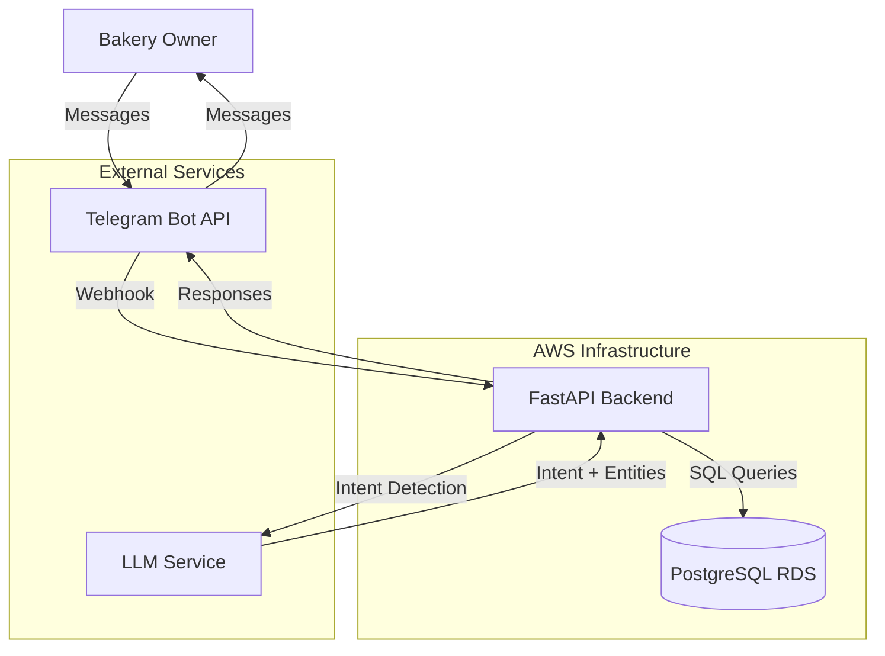
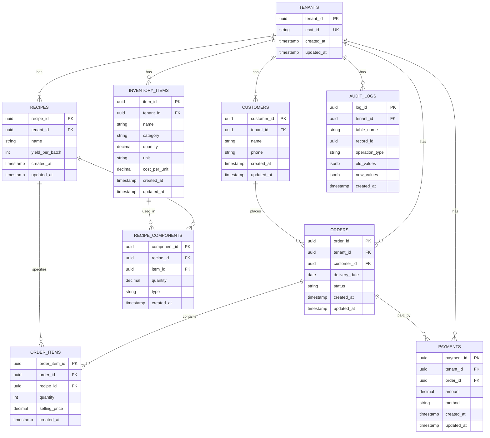

# Design Document: Bakery Operations Telegram Bot

## Overview

The Bakery Operations Telegram Bot is a conversational interface for home bakery owners to manage their business operations through natural language interactions. The system consists of four main components:

1. **Telegram Bot Interface**: Receives messages from bakery owners and sends responses
2. **FastAPI Backend**: Processes commands, manages business logic, and orchestrates data operations
3. **PostgreSQL Database**: Stores all operational data with strict tenant isolation
4. **LLM Integration**: Provides intent detection and entity extraction from natural language inputs

The system follows a single-service architecture where all business logic resides in the FastAPI backend. The LLM is used exclusively for understanding user intent and extracting structured data from messages - it does not execute business logic, perform calculations, or access the database directly.

### Key Design Principles

- **Tenant Isolation**: Every database query includes Tenant_ID filtering to ensure complete data separation
- **LLM as Parser Only**: The LLM translates natural language to structured intents and entities; all business logic executes in the backend
- **Automatic Onboarding**: First message from a new Chat_ID automatically creates a tenant
- **Audit Trail**: All UPDATE and DELETE operations are logged for accountability
- **Input Validation**: All user inputs are validated before processing to prevent data corruption

## Architecture

### System Components



### Request Flow

1. **Message Reception**: Telegram sends webhook POST request to FastAPI endpoint with message payload
2. **Tenant Resolution**: Backend extracts Chat_ID and resolves to Tenant_ID (creates tenant if new)
3. **Intent Detection**: Backend sends message text to LLM for intent classification and entity extraction
4. **Validation**: Backend validates extracted entities against business rules
5. **Business Logic Execution**: Backend executes appropriate operation with database transactions
6. **Audit Logging**: For UPDATE/DELETE operations, backend creates audit log entries
7. **Response Generation**: Backend formats response message
8. **Message Delivery**: Backend sends response via Telegram Bot API

### Component Responsibilities

**Telegram Bot Interface**
- Receives messages from users via webhook
- Sends formatted responses back to users
- Handles Telegram-specific message formatting (markdown, buttons)

**FastAPI Backend**
- Manages all business logic and workflows
- Performs tenant resolution and validation
- Orchestrates LLM calls for intent detection
- Executes database operations with proper isolation
- Implements input validation and error handling
- Generates audit logs for data changes
- Formats user-friendly responses

**LLM Integration**
- Classifies user intent from message text
- Extracts entities (names, quantities, dates, prices)
- Returns structured JSON with intent and entities
- Does NOT execute business logic or calculations
- Does NOT access database directly

**PostgreSQL Database**
- Stores all operational data with tenant isolation
- Enforces referential integrity via foreign keys
- Provides ACID guarantees for transactions
- Stores audit logs for compliance

## Components and Interfaces

### API Endpoints

All endpoints receive Telegram webhook payloads and return responses.

**POST /webhook**
- Receives all incoming Telegram messages
- Extracts Chat_ID and message text
- Routes to appropriate handler based on detected intent
- Returns 200 OK to Telegram (actual response sent asynchronously)

### Internal Service Interfaces

**TenantService**
```python
class TenantService:
    def get_or_create_tenant(chat_id: str) -> UUID
    def get_tenant_by_chat_id(chat_id: str) -> Optional[UUID]
```

**LLMService**
```python
class LLMService:
    def detect_intent(message: str) -> IntentResult
    
class IntentResult:
    intent: str  # e.g., "create_customer", "add_inventory"
    entities: Dict[str, Any]  # extracted data
    confidence: float
```

**CustomerService**
```python
class CustomerService:
    def create_customer(tenant_id: UUID, name: str, phone: str) -> Customer
    def get_customer(tenant_id: UUID, search: str) -> List[Customer]
    def list_customers(tenant_id: UUID) -> List[Customer]
```

**InventoryService**
```python
class InventoryService:
    def create_item(tenant_id: UUID, item: InventoryItemCreate) -> InventoryItem
    def update_item(tenant_id: UUID, name: str, updates: Dict) -> InventoryItem
    def get_item(tenant_id: UUID, name: str) -> Optional[InventoryItem]
    def list_items(tenant_id: UUID) -> List[InventoryItem]
```

**RecipeService**
```python
class RecipeService:
    def create_recipe(tenant_id: UUID, name: str, yield_per_batch: int) -> Recipe
    def add_component(tenant_id: UUID, recipe_name: str, component: RecipeComponentCreate) -> RecipeComponent
    def calculate_cost(tenant_id: UUID, recipe_name: str) -> RecipeCost
    def format_recipe(tenant_id: UUID, recipe_name: str) -> str
```

**OrderService**
```python
class OrderService:
    def create_order(tenant_id: UUID, order: OrderCreate) -> Order
    def mark_delivered(tenant_id: UUID, order_id: UUID) -> Order
    def get_upcoming_orders(tenant_id: UUID) -> List[Order]
    def get_unpaid_orders(tenant_id: UUID) -> List[OrderWithPayment]
```

**PaymentService**
```python
class PaymentService:
    def record_payment(tenant_id: UUID, payment: PaymentCreate) -> Payment
    def get_payment_history(tenant_id: UUID, start_date: Optional[date], end_date: Optional[date]) -> List[Payment]
```

**ReportingService**
```python
class ReportingService:
    def calculate_weekly_profit(tenant_id: UUID) -> WeeklyProfitReport
    
class WeeklyProfitReport:
    total_revenue: Decimal
    total_ingredient_cost: Decimal
    total_packaging_cost: Decimal
    gross_profit: Decimal
    week_start: date
    week_end: date
```

**AuditService**
```python
class AuditService:
    def log_change(tenant_id: UUID, table: str, record_id: UUID, operation: str, old_values: Dict, new_values: Dict)
```

## Data Models

### Database Schema



### Table Definitions

**tenants**
- `tenant_id` (UUID, PK): Unique identifier for the tenant
- `chat_id` (VARCHAR, UNIQUE): Telegram Chat_ID
- `created_at` (TIMESTAMP): Tenant creation time
- `updated_at` (TIMESTAMP): Last update time

**customers**
- `customer_id` (UUID, PK): Unique identifier
- `tenant_id` (UUID, FK): References tenants
- `name` (VARCHAR): Customer name
- `phone` (VARCHAR): Customer phone number
- `created_at` (TIMESTAMP): Record creation time
- `updated_at` (TIMESTAMP): Last update time
- UNIQUE constraint on (tenant_id, phone)

**inventory_items**
- `item_id` (UUID, PK): Unique identifier
- `tenant_id` (UUID, FK): References tenants
- `name` (VARCHAR): Item name
- `category` (VARCHAR): "ingredient" or "packaging"
- `quantity` (DECIMAL): Current stock quantity
- `unit` (VARCHAR): "kg", "g", "litre", "ml", "pcs"
- `cost_per_unit` (DECIMAL): Cost per unit
- `created_at` (TIMESTAMP): Record creation time
- `updated_at` (TIMESTAMP): Last update time
- UNIQUE constraint on (tenant_id, name)

**recipes**
- `recipe_id` (UUID, PK): Unique identifier
- `tenant_id` (UUID, FK): References tenants
- `name` (VARCHAR): Recipe name
- `yield_per_batch` (INTEGER): Number of units produced per batch
- `created_at` (TIMESTAMP): Record creation time
- `updated_at` (TIMESTAMP): Last update time
- UNIQUE constraint on (tenant_id, name)

**recipe_components**
- `component_id` (UUID, PK): Unique identifier
- `recipe_id` (UUID, FK): References recipes
- `item_id` (UUID, FK): References inventory_items
- `quantity` (DECIMAL): Quantity of item used
- `type` (VARCHAR): "ingredient" or "packaging"
- `created_at` (TIMESTAMP): Record creation time

**orders**
- `order_id` (UUID, PK): Unique identifier
- `tenant_id` (UUID, FK): References tenants
- `customer_id` (UUID, FK): References customers
- `delivery_date` (DATE): Scheduled delivery date
- `status` (VARCHAR): "pending" or "delivered"
- `created_at` (TIMESTAMP): Record creation time
- `updated_at` (TIMESTAMP): Last update time

**order_items**
- `order_item_id` (UUID, PK): Unique identifier
- `order_id` (UUID, FK): References orders
- `recipe_id` (UUID, FK): References recipes
- `quantity` (INTEGER): Number of units ordered
- `selling_price` (DECIMAL): Price per unit
- `created_at` (TIMESTAMP): Record creation time

**payments**
- `payment_id` (UUID, PK): Unique identifier
- `tenant_id` (UUID, FK): References tenants
- `order_id` (UUID, FK): References orders
- `amount` (DECIMAL): Payment amount
- `method` (VARCHAR): "Cash", "Paytm", "Bank Transfer"
- `created_at` (TIMESTAMP): Record creation time
- `updated_at` (TIMESTAMP): Last update time

**audit_logs**
- `log_id` (UUID, PK): Unique identifier
- `tenant_id` (UUID, FK): References tenants
- `table_name` (VARCHAR): Name of table modified
- `record_id` (UUID): ID of record modified
- `operation_type` (VARCHAR): "UPDATE" or "DELETE"
- `old_values` (JSONB): Previous values
- `new_values` (JSONB): New values
- `created_at` (TIMESTAMP): Log creation time

### Data Model Classes

**Python Models (using SQLAlchemy)**

```python
from sqlalchemy import Column, String, Integer, Decimal, Date, DateTime, ForeignKey, Enum
from sqlalchemy.dialects.postgresql import UUID, JSONB
from sqlalchemy.orm import relationship
import uuid
from datetime import datetime

class Tenant(Base):
    __tablename__ = "tenants"
    tenant_id = Column(UUID(as_uuid=True), primary_key=True, default=uuid.uuid4)
    chat_id = Column(String, unique=True, nullable=False)
    created_at = Column(DateTime, default=datetime.utcnow)
    updated_at = Column(DateTime, default=datetime.utcnow, onupdate=datetime.utcnow)

class Customer(Base):
    __tablename__ = "customers"
    customer_id = Column(UUID(as_uuid=True), primary_key=True, default=uuid.uuid4)
    tenant_id = Column(UUID(as_uuid=True), ForeignKey("tenants.tenant_id"), nullable=False)
    name = Column(String, nullable=False)
    phone = Column(String, nullable=False)
    created_at = Column(DateTime, default=datetime.utcnow)
    updated_at = Column(DateTime, default=datetime.utcnow, onupdate=datetime.utcnow)
    __table_args__ = (UniqueConstraint('tenant_id', 'phone'),)

class InventoryItem(Base):
    __tablename__ = "inventory_items"
    item_id = Column(UUID(as_uuid=True), primary_key=True, default=uuid.uuid4)
    tenant_id = Column(UUID(as_uuid=True), ForeignKey("tenants.tenant_id"), nullable=False)
    name = Column(String, nullable=False)
    category = Column(Enum("ingredient", "packaging", name="category_enum"), nullable=False)
    quantity = Column(Decimal(10, 2), nullable=False)
    unit = Column(Enum("kg", "g", "litre", "ml", "pcs", name="unit_enum"), nullable=False)
    cost_per_unit = Column(Decimal(10, 2), nullable=False)
    created_at = Column(DateTime, default=datetime.utcnow)
    updated_at = Column(DateTime, default=datetime.utcnow, onupdate=datetime.utcnow)
    __table_args__ = (UniqueConstraint('tenant_id', 'name'),)

class Recipe(Base):
    __tablename__ = "recipes"
    recipe_id = Column(UUID(as_uuid=True), primary_key=True, default=uuid.uuid4)
    tenant_id = Column(UUID(as_uuid=True), ForeignKey("tenants.tenant_id"), nullable=False)
    name = Column(String, nullable=False)
    yield_per_batch = Column(Integer, nullable=False)
    created_at = Column(DateTime, default=datetime.utcnow)
    updated_at = Column(DateTime, default=datetime.utcnow, onupdate=datetime.utcnow)
    __table_args__ = (UniqueConstraint('tenant_id', 'name'),)

class RecipeComponent(Base):
    __tablename__ = "recipe_components"
    component_id = Column(UUID(as_uuid=True), primary_key=True, default=uuid.uuid4)
    recipe_id = Column(UUID(as_uuid=True), ForeignKey("recipes.recipe_id"), nullable=False)
    item_id = Column(UUID(as_uuid=True), ForeignKey("inventory_items.item_id"), nullable=False)
    quantity = Column(Decimal(10, 2), nullable=False)
    type = Column(Enum("ingredient", "packaging", name="component_type_enum"), nullable=False)
    created_at = Column(DateTime, default=datetime.utcnow)

class Order(Base):
    __tablename__ = "orders"
    order_id = Column(UUID(as_uuid=True), primary_key=True, default=uuid.uuid4)
    tenant_id = Column(UUID(as_uuid=True), ForeignKey("tenants.tenant_id"), nullable=False)
    customer_id = Column(UUID(as_uuid=True), ForeignKey("customers.customer_id"), nullable=False)
    delivery_date = Column(Date, nullable=False)
    status = Column(Enum("pending", "delivered", name="order_status_enum"), nullable=False, default="pending")
    created_at = Column(DateTime, default=datetime.utcnow)
    updated_at = Column(DateTime, default=datetime.utcnow, onupdate=datetime.utcnow)

class OrderItem(Base):
    __tablename__ = "order_items"
    order_item_id = Column(UUID(as_uuid=True), primary_key=True, default=uuid.uuid4)
    order_id = Column(UUID(as_uuid=True), ForeignKey("orders.order_id"), nullable=False)
    recipe_id = Column(UUID(as_uuid=True), ForeignKey("recipes.recipe_id"), nullable=False)
    quantity = Column(Integer, nullable=False)
    selling_price = Column(Decimal(10, 2), nullable=False)
    created_at = Column(DateTime, default=datetime.utcnow)

class Payment(Base):
    __tablename__ = "payments"
    payment_id = Column(UUID(as_uuid=True), primary_key=True, default=uuid.uuid4)
    tenant_id = Column(UUID(as_uuid=True), ForeignKey("tenants.tenant_id"), nullable=False)
    order_id = Column(UUID(as_uuid=True), ForeignKey("orders.order_id"), nullable=False)
    amount = Column(Decimal(10, 2), nullable=False)
    method = Column(Enum("Cash", "Paytm", "Bank Transfer", name="payment_method_enum"), nullable=False)
    created_at = Column(DateTime, default=datetime.utcnow)
    updated_at = Column(DateTime, default=datetime.utcnow, onupdate=datetime.utcnow)

class AuditLog(Base):
    __tablename__ = "audit_logs"
    log_id = Column(UUID(as_uuid=True), primary_key=True, default=uuid.uuid4)
    tenant_id = Column(UUID(as_uuid=True), ForeignKey("tenants.tenant_id"), nullable=False)
    table_name = Column(String, nullable=False)
    record_id = Column(UUID(as_uuid=True), nullable=False)
    operation_type = Column(Enum("UPDATE", "DELETE", name="operation_type_enum"), nullable=False)
    old_values = Column(JSONB)
    new_values = Column(JSONB)
    created_at = Column(DateTime, default=datetime.utcnow)
```


## Correctness Properties

*A property is a characteristic or behavior that should hold true across all valid executions of a system-essentially, a formal statement about what the system should do. Properties serve as the bridge between human-readable specifications and machine-verifiable correctness guarantees.*

### Property 1: Tenant Creation from Unknown Chat_ID

*For any* unknown Chat_ID, when a message is received, the system should create a new Tenant record with a valid UUID, link it to the Chat_ID, include created_at and updated_at timestamps, and send a welcome message.

**Validates: Requirements 1.1, 1.2, 1.3, 1.4, 1.5**

### Property 2: Customer Creation with Valid Data

*For any* tenant and valid customer data (name and phone), creating a customer should result in a Customer record with all required fields (customer_id, tenant_id, name, phone, created_at, updated_at) and a confirmation message.

**Validates: Requirements 2.2, 2.6, 2.7**

### Property 3: Duplicate Phone Number Rejection

*For any* tenant, attempting to create a customer with a phone number that already exists for that tenant should be rejected with an error message indicating duplicate customer.

**Validates: Requirements 2.4, 2.5, 3.6**

### Property 4: Missing Customer Data Prompts

*For any* customer creation request with missing name or phone number, the system should request the missing information rather than creating an incomplete record.

**Validates: Requirements 2.3**

### Property 5: Customer Search Tenant Isolation

*For any* customer search query, the results should only include customers belonging to the requesting tenant, never customers from other tenants.

**Validates: Requirements 3.2, 4.1**

### Property 6: Customer Search Disambiguation

*For any* customer search by name that matches multiple customers, the system should display all matching customers with their phone numbers for disambiguation.

**Validates: Requirements 3.4**

### Property 7: Customer Not Found Handling

*For any* customer search that matches no customers, the system should return a message indicating customer not found.

**Validates: Requirements 3.5**

### Property 8: Single Customer Match Display

*For any* customer search that matches exactly one customer, the system should display the complete customer details.

**Validates: Requirements 3.3**

### Property 9: Inventory Item Creation with Valid Data

*For any* tenant and valid inventory data (name, category, quantity, unit, cost_per_unit), creating an inventory item should result in an Inventory_Item record with all required fields and a confirmation message.

**Validates: Requirements 5.5, 5.6**

### Property 10: Inventory Category Validation

*For any* inventory item creation or update, the category must be either "ingredient" or "packaging", and any other value should be rejected with a validation error.

**Validates: Requirements 5.2**

### Property 11: Inventory Unit Validation

*For any* inventory item creation or update, the unit must be one of: kg, g, litre, ml, pcs, and any other value should be rejected with a validation error.

**Validates: Requirements 5.3**

### Property 12: Missing Inventory Data Prompts

*For any* inventory creation request with missing required fields, the system should request the missing information rather than creating an incomplete record.

**Validates: Requirements 5.4**

### Property 13: Inventory Update with Audit Logging

*For any* inventory item update, the system should update the specified fields, set the updated_at timestamp, create an audit log entry with old and new values, and return a confirmation message.

**Validates: Requirements 6.4, 6.5, 6.6, 21.3**

### Property 14: Inventory Item Not Found Handling

*For any* inventory update or stock check for a non-existent item, the system should return an error message indicating the item was not found.

**Validates: Requirements 6.3, 7.4**

### Property 15: Inventory Tenant Isolation

*For any* inventory operation (update, stock check, list), the results should only include items belonging to the requesting tenant, never items from other tenants.

**Validates: Requirements 6.2, 7.2, 8.1**

### Property 16: Inventory Listing Grouped by Category

*For any* inventory listing request, the system should display items grouped by category (ingredients and packaging) with name, quantity, unit, and cost_per_unit for each item.

**Validates: Requirements 8.2, 8.3**

### Property 17: Recipe Creation with Valid Data

*For any* tenant and valid recipe data (name and yield_per_batch), creating a recipe should result in a Recipe record with all required fields and a confirmation message prompting for ingredients.

**Validates: Requirements 9.2, 9.3**

### Property 18: Recipe Component Addition with Validation

*For any* recipe component addition, the system should validate that the inventory item exists for the tenant, validate that the component type is either "ingredient" or "packaging", create a Recipe_Component record with all required fields, and return a confirmation message.

**Validates: Requirements 10.2, 10.3, 10.4, 10.5**

### Property 19: Recipe Cost Calculation Correctness

*For any* recipe with components, the ingredient_cost should equal SUM(component.quantity × inventory_item.cost_per_unit) for all ingredient components, the packaging_cost should equal SUM(component.quantity × inventory_item.cost_per_unit) for all packaging components, and the unit_cost should equal (ingredient_cost + packaging_cost) / recipe.yield_per_batch.

**Validates: Requirements 11.3, 11.4, 11.5**

### Property 20: Recipe Cost Tenant Isolation

*For any* recipe cost calculation, the system should only retrieve recipe components and inventory items belonging to the requesting tenant.

**Validates: Requirements 11.2**

### Property 21: Recipe Cost Display Completeness

*For any* recipe cost request, the system should display ingredient_cost, packaging_cost, and unit_cost.

**Validates: Requirements 11.6**

### Property 22: Order Creation with Valid Data

*For any* tenant and valid order data (customer identifier, delivery date, order items), creating an order should result in an Order record with status "pending" and all required fields, Order_Item records for each item, and a confirmation message with order details.

**Validates: Requirements 12.4, 12.5, 12.6**

### Property 23: Order Customer Resolution

*For any* order creation, the system should resolve the customer by name or phone for the tenant, and if multiple customers match by name, request disambiguation via phone number.

**Validates: Requirements 12.2, 12.3**

### Property 24: Order Delivery Marking with Audit Logging

*For any* order marked as delivered, the system should update the status to "delivered", set the updated_at timestamp, create an audit log entry, and return a confirmation message.

**Validates: Requirements 13.3, 13.4, 13.5, 21.4**

### Property 25: Order Tenant Isolation

*For any* order operation (mark delivered, retrieve, list), the results should only include orders belonging to the requesting tenant, never orders from other tenants.

**Validates: Requirements 13.2**

### Property 26: Upcoming Orders Filtering and Sorting

*For any* upcoming orders request, the system should retrieve only orders with status "pending" for the tenant, sort them by delivery_date ascending, and display order details including customer name, items, quantities, delivery date, and total price.

**Validates: Requirements 14.1, 14.2, 14.3**

### Property 27: Payment Recording with Valid Data

*For any* tenant and valid payment data (order identifier, amount, payment method), recording a payment should validate the payment method is one of: Cash, Paytm, Bank Transfer, create a Payment record with all required fields, and return a confirmation message.

**Validates: Requirements 15.2, 15.4, 15.5**

### Property 28: Payment Tenant Isolation

*For any* payment operation (record, history), the system should only access orders and payments belonging to the requesting tenant.

**Validates: Requirements 15.3, 17.1**

### Property 29: Unpaid Orders Identification

*For any* unpaid orders request, the system should retrieve all orders for the tenant, LEFT JOIN with payments to identify orders with no associated payment or partial payment, and display order details including customer name, total amount, and amount paid.

**Validates: Requirements 16.1, 16.2, 16.3**

### Property 30: Payment History Sorting and Filtering

*For any* payment history request, the system should retrieve all payments for the tenant, sort them by created_at descending, display payment details including customer name, order reference, amount, method, and date, and when a date range is specified, filter payments by created_at within the range.

**Validates: Requirements 17.2, 17.3, 17.4**

### Property 31: Weekly Profit Calculation Correctness

*For any* weekly profit request, the system should calculate the date range for the current week (Monday to Sunday), retrieve all orders with status "delivered" and delivery_date within the week for the tenant, calculate total_revenue as SUM(order_item.quantity × order_item.selling_price), calculate total_ingredient_cost by summing recipe ingredient costs for all delivered order items, calculate total_packaging_cost by summing recipe packaging costs for all delivered order items, calculate gross_profit as total_revenue - total_ingredient_cost - total_packaging_cost, and display all four values.

**Validates: Requirements 18.1, 18.2, 18.3, 18.4, 18.5, 18.6, 18.7**

### Property 32: Cross-Tenant Data Access Prevention

*For any* operation, the system should prevent access to data belonging to other tenants, ensuring complete data isolation.

**Validates: Requirements 19.1, 19.3**

### Property 33: Tenant Resolution from Chat_ID

*For any* request, the system should derive the Tenant_ID from the Chat_ID, validate the Tenant_ID exists, and if it cannot be resolved, trigger onboarding.

**Validates: Requirements 19.2, 19.4, 19.5**

### Property 34: Numeric Input Validation

*For any* numeric input (quantity, cost, price, amount), the system should validate that the value is a positive number and reject zero or negative values with a descriptive error message.

**Validates: Requirements 20.1, 20.5**

### Property 35: Phone Number Validation

*For any* phone number input, the system should validate that it contains only digits and optional country code, rejecting invalid formats with a descriptive error message.

**Validates: Requirements 20.2, 20.5**

### Property 36: Order Date Validation

*For any* order date input, the system should validate that the date is in valid format and not in the past, rejecting invalid or past dates with a descriptive error message.

**Validates: Requirements 20.3, 20.5**

### Property 37: SQL Injection Prevention

*For any* text input, the system should sanitize the input to prevent SQL injection attacks, ensuring all inputs are safely handled.

**Validates: Requirements 20.4**

### Property 38: Audit Logging for Modifications

*For any* UPDATE or DELETE operation, the system should create an audit_log record with Tenant_ID, table_name, record_id, operation_type, old_values, new_values, and timestamp.

**Validates: Requirements 21.1, 21.2**

### Property 39: No Audit Logging for Reads

*For any* SELECT operation, the system should not create an audit log entry.

**Validates: Requirements 21.5**

### Property 40: LLM Intent Classification and Entity Extraction

*For any* message received, the LLM should classify the intent and extract entities, the backend should validate extracted entities before processing, and if the LLM cannot determine intent with confidence, the system should ask for clarification.

**Validates: Requirements 22.1, 22.2, 22.3, 22.4**

### Property 41: User-Friendly Error Messages

*For any* error (database error, validation failure, resource not found), the system should return a user-friendly message that explains the issue without exposing internal error details or stack traces, and all error messages should follow a consistent format.

**Validates: Requirements 23.1, 23.2, 23.3, 23.4, 23.5**

### Property 42: Recipe Round-Trip Property

*For any* valid Recipe object, retrieving the recipe, formatting it with the Pretty_Printer, and parsing it back should produce an equivalent object with the same name, yield, ingredients list, packaging list, quantities, units, and costs.

**Validates: Requirements 24.1, 24.2, 24.3, 24.4, 24.5**

## Error Handling

### Error Categories

**Validation Errors**
- Missing required fields
- Invalid data types or formats
- Out-of-range values
- Constraint violations (e.g., duplicate phone numbers)

**Not Found Errors**
- Customer not found
- Inventory item not found
- Recipe not found
- Order not found

**Business Logic Errors**
- Insufficient inventory
- Invalid state transitions
- Referential integrity violations

**System Errors**
- Database connection failures
- LLM service unavailable
- Telegram API errors

### Error Response Format

All errors follow a consistent JSON structure:

```json
{
  "error": true,
  "error_type": "validation_error | not_found | business_logic_error | system_error",
  "message": "User-friendly error description",
  "details": {
    "field": "field_name",
    "constraint": "constraint_violated"
  }
}
```

### Error Handling Principles

1. **User-Friendly Messages**: All error messages are written in plain language without technical jargon
2. **No Internal Details**: Stack traces, SQL queries, and internal error codes are never exposed to users
3. **Actionable Guidance**: Error messages explain what went wrong and how to fix it
4. **Consistent Format**: All errors follow the same structure for predictable handling
5. **Proper Logging**: All errors are logged with full details for debugging while showing simplified messages to users

### Specific Error Scenarios

**Duplicate Customer Phone**
- Message: "A customer with phone number {phone} already exists. Please use a different phone number or update the existing customer."

**Invalid Inventory Category**
- Message: "Invalid category '{category}'. Please use either 'ingredient' or 'packaging'."

**Invalid Unit**
- Message: "Invalid unit '{unit}'. Please use one of: kg, g, litre, ml, pcs."

**Negative Quantity**
- Message: "Quantity must be a positive number. You entered: {quantity}."

**Past Order Date**
- Message: "Order delivery date cannot be in the past. Please provide a future date."

**Item Not Found**
- Message: "Inventory item '{name}' not found. Please check the name and try again."

**Customer Not Found**
- Message: "No customer found matching '{search}'. Please check the name or phone number."

**Recipe Not Found**
- Message: "Recipe '{name}' not found. Please create the recipe first."

**Order Not Found**
- Message: "Order '{identifier}' not found. Please check the order ID."

**Invalid Payment Method**
- Message: "Invalid payment method '{method}'. Please use one of: Cash, Paytm, Bank Transfer."

**LLM Low Confidence**
- Message: "I'm not sure what you're trying to do. Could you please rephrase your request?"

**Database Connection Error**
- Message: "We're experiencing technical difficulties. Please try again in a moment."

**LLM Service Unavailable**
- Message: "The natural language processing service is temporarily unavailable. Please try again shortly."

## Testing Strategy

### Dual Testing Approach

The system requires both unit testing and property-based testing for comprehensive coverage:

**Unit Tests**: Verify specific examples, edge cases, and error conditions
- Specific customer creation scenarios
- Edge cases like empty inventory lists
- Error conditions like duplicate phone numbers
- Integration points between services
- Database transaction rollback scenarios

**Property Tests**: Verify universal properties across all inputs
- Tenant isolation across all operations
- Calculation correctness for all recipes and profit reports
- Validation rules for all input types
- Audit logging for all modifications
- Round-trip properties for serialization

Together, these approaches provide comprehensive coverage where unit tests catch concrete bugs and property tests verify general correctness.

### Property-Based Testing Configuration

**Library Selection**: Use Hypothesis for Python property-based testing

**Test Configuration**:
- Minimum 100 iterations per property test (due to randomization)
- Each property test must reference its design document property
- Tag format: `# Feature: bakery-ops-telegram-bot, Property {number}: {property_text}`

**Example Property Test Structure**:

```python
from hypothesis import given, strategies as st
import pytest

# Feature: bakery-ops-telegram-bot, Property 3: Duplicate Phone Number Rejection
@given(
    tenant_id=st.uuids(),
    name1=st.text(min_size=1, max_size=100),
    name2=st.text(min_size=1, max_size=100),
    phone=st.text(min_size=10, max_size=15, alphabet=st.characters(whitelist_categories=('Nd',)))
)
@pytest.mark.property_test
def test_duplicate_phone_rejection(tenant_id, name1, name2, phone):
    """For any tenant, attempting to create a customer with a phone number 
    that already exists should be rejected."""
    # Create first customer
    customer1 = create_customer(tenant_id, name1, phone)
    assert customer1 is not None
    
    # Attempt to create second customer with same phone
    with pytest.raises(DuplicateCustomerError) as exc_info:
        create_customer(tenant_id, name2, phone)
    
    assert "already exists" in str(exc_info.value).lower()
```

### Test Coverage Requirements

**Unit Test Coverage**:
- All service methods
- All validation functions
- All error handling paths
- All database operations
- All LLM integration points

**Property Test Coverage**:
- All 42 correctness properties defined in this document
- Each property must have at least one property-based test
- Tests must run with minimum 100 iterations

**Integration Test Coverage**:
- End-to-end message flow from Telegram to database
- Multi-step workflows (create recipe, add components, calculate cost)
- Transaction rollback scenarios
- Concurrent request handling

### Testing Tools and Frameworks

**Unit Testing**: pytest
**Property-Based Testing**: Hypothesis
**Database Testing**: pytest-postgresql for test database fixtures
**API Testing**: httpx for async HTTP testing
**Mocking**: pytest-mock for LLM and Telegram API mocking

### Test Data Generation

**Hypothesis Strategies**:
- Custom strategies for valid phone numbers
- Custom strategies for valid inventory units
- Custom strategies for valid payment methods
- Custom strategies for valid dates (future dates for orders)
- Custom strategies for tenant-scoped data

**Test Fixtures**:
- Tenant fixtures with isolated test data
- Customer fixtures with various name/phone combinations
- Inventory fixtures with ingredients and packaging
- Recipe fixtures with components
- Order fixtures with various statuses

### Continuous Testing

**Pre-Commit Hooks**:
- Run unit tests on changed files
- Run linting and type checking

**CI/CD Pipeline**:
- Run full unit test suite
- Run full property test suite (100 iterations per property)
- Generate coverage reports
- Fail build if coverage drops below 80%

**Performance Testing**:
- Load testing for concurrent Telegram webhooks
- Database query performance testing
- LLM response time monitoring

